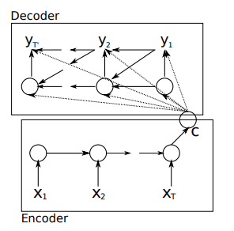
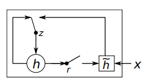
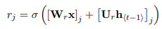
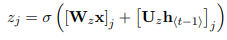
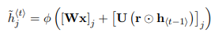
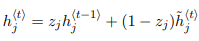
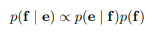
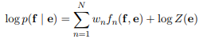
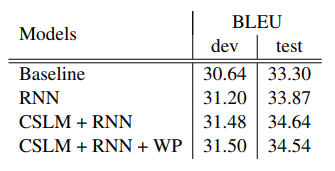
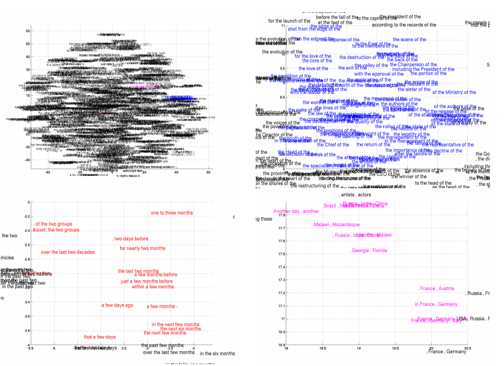

조경현 교수님이 쓰신 Learning Phrase Representations using RNN Encoder–Decoder for Statistical Machine Translation [논문]("https://www.aclweb.org/anthology/D14-1179")에 대해 다뤄보도록 하겠습니다. 모든 내용과 이미지는 해당 논문을 참고합니다.

구현 코드는 [깃헙]("https://github.com/hskimim/Natural_language_Processing_self_study/tree/master/RNN_Seq2Seq") 사이트를 참고해주시면 감사하겠습니다.

## Abstract

두 개의 RNN 으로 이뤄진 RNN Encoder-Decoder 모델을 제시한다.
Encoder 는 Sequence of symbols 를 고정된 길이의 벡터 표현으로 변환하고, Decoder는 이러한 벡터 표현을 다시 Sequence of symbols로 만들어준다. Encoder, Decoder는 Source data에서 Target data가 나올 조건부 확률을 최대화하는 방향으로 동시에 학습된다.

## Introduction

RNN Encoder-Decoder 모델을 제안하며, 추가적으로 더 훌륭한(sophisticated) hidden units 의 아이디어를 제시한다. (긴 문장에 대한 정보를 잘 기억해내고 연산의 비용이 상대적으로 저렴한 아이디어)

해당 모델은 English-French 번역에 사용된다. 즉, English 의 구절과 이와 매칭되는 French 구절이 나올 확률을 최대화하는 방향으로 모델이 학습된다.

학습 이후, 모델의 Benchmark 로써 현존하는 번역기와 번역성능점수를 비교한다. 해당 분석은 RNN Encoder-Decoder 모델이 언어적 정규성(linguistic regularity)을 더 잘 포착하며, 전체 번역 성능 또한 향상시켰음을 나타낸다. 추가적인 분석은 RNN Encoder-Decoder 모델이 의미론적 그리고 동의적 구조를 잘 보존하는 연속적 공간 표현(continous space representation)을 학습했음을 시사한다.

## RNN Encoder Decoder

**1. 사전 숙지 사항 : RNN(Recurrent Neural Network)**

$$h_{t} = f(h_{t-1},x_{t})$$

매시점 $t$ 마다 hidden state $h_{t}$는 이전 시점 t-1 의 hidden state와 동일 시점의 sequence source data $x_{t}$ 를 non-linear function 을 적용한 것으로 update된다. 여기서 non-linear function $f$ 는 logistic 과 같은 단순한 형태에서 LSTM 과 같은 구조로 유연하게 설정될 수 있다.

RNN 은 해당 sequence 의 확률 분포를 다음 스텝의 sequence 를 예측하기 위해 학습된다. 이 경우, $output_{t}$ 는 softmax function 을 적용하면 조건부 분포(conditional probability)이자 다항 분포(multinomial distribution)인 $$$p(x_{t}|x_{t-1},...,x_{1})$$$ 을 따른다.

**2. RNN  Encoder - Decoder**

encoder 는 다양한 길이의 시퀀스(variable-length sequence)데이터를  고정 길이의 벡터 표현으로 인코딩한다. decoder는 고정 길이의 벡터 표현을 다시 다양한 길이의 시퀀스로 돌려놓는다. 확률론적 관점으로는 $$$p\(y_{1},..,y_{T'}|x_{1},...,x_{T}\)$$$ 가 되며, $T'$과 $T$ 는 다를 수 있다.

RNN 의 encoder는 sequence X를 순차적으로 하나씩 읽어드린다. 이를 통해 위에서 언급한 $h_t$ 에 대한 식이 적용되며 값이 업데이트된다. 다 읽어드린 후에는 RNN의 hidden state는 전체 input sequence 의 요약 벡터 **c** 가 된다. RNN 의 decoder는 $h_{t}$
를 통해 $y_{t}$를 예측 및 생성(generate) 하는 단계이다.

$$h_{t} = f(h_{t-1},y_{t-1},c)$$

이렇게 나온 decoder의 $output_{t}$ 는 마찬가지로 conditional probability 이자 multinomial distribution 을 따른다.

**3. Hidden Unit that Adaptively Remembers and forgets**

(여기서 조경현 교수님이 GRU 모델을 제시합니다. GRU의 아키텍처에 대해 논할 땐, 논문을 기초로 하며 추가적으로 이야기를 해보겠습니다.)

훌륭한 모델의 아키텍처에 더해서, 새로운 타입의 hidden unit을 제안한다. LSTM에서 모티브를 받았지만, 연산 과정이 훨씬 간단해졌다. 아래의 이미지는 전체적인 프로세스를 나타낸다.

위의 식$r_{j}$는 reset gate라고 불리며, 앞의 $\sigma$가 의미하는 것은 logistic sigmoid function으로 [0,1] 값을 가지게 됩니다. 이에 따라, `얼마나 이전 스텝의 정보를 잊어버릴 지`에 대한 것을 결정하는 요소입니다.

위의 식$z_{j}$은 update gate라고 불리며, reset gate와 함께 logistic sigmoid function이 적용되 [0,1] 값을 가집니다. 해당 정보는 hidden unit $h_t$가 업데이트될 때 사용됩니다.

위의 식에서 reset gate 가 사용되는데, 이전 시점의 hidden units $h_{t-1}$과 Hadamard product(요소별 곱셈)가 취해지면서 이전 시점 $t-1$의 hidden units 정보를 얼마나 유지할 지를 결정하게 되고, 우변의 첫 번째 요소인 $Wx_{j}$는 현시점의 정보이기 때문에, 이를 합산하고 tanh activation을 취해 [-1,1]값을 가지게 한 부분이 됩니다. (tanh를 취해주는 것은 기존의 vanila RNN과 유사한 hidden state 업데이트 방식입니다.) 이렇게 해서 나온 값은 현재 시점의 정보를 담고 있는 hidden unit 이라고 할 수 있습니다.

이제 새로운 hidden unit $h_{t}$를 업데이트해주어야겠죠. 우변의 앞의 부분부터 보면, 이전 시점의 hidden unit에 update gate를 곱해주면서, ``이전 시점을 얼마나 받아드릴 지에 대한 값``이 됩니다. 뒤에 부분은, 받아드리는 만큼의 나머지 부분을 현재 시점의 정보로 채운다의 개념으로써, $z_j$의 정도에 따라서, 얼마나 잊고 얼마나 변해갈지를 정하는 파라미터가 되겠습니다. 보다 명쾌하고 쉬운 설명은 [ratsgo]("https://ratsgo.github.io/deep%20learning/2017/05/13/GRU/")님의 블로그를 추천드립니다.

(다시 논문으로 돌아가서)

reset gate가 0으로 가까워질 수록, hidden state는 이전의 hidden state를 잊게끔 강제되고, 현재의 인풋 데이터에 따라 reset된다.

update gate의 경우, 이전의 hiddens state의 정보가 현재의 hidden state에 얼마나 많은 영향을 끼칠 것인지에 대해 결정하는 통제 파라미터가 된다.

## Statistical Machine Translation

흔히 사용되는 통계적 기법의 기계 번역(SMT라 불립니다.)의 목표는(구체적으로 말하면 해당 아키텍처에서는 Decoder) source sentence $e$ 가 주어졌을 때,(우리의 예시에서는 English phrase) 아래의 최대화하는 번역본 $f$ 을 찾는 것이다.

위의 식의 우변에서 첫 번째 부분은 translation model이라고 불리고 두 번째 부분은 language model이라고 불린다. 실질적으로 대부분의 SMT는 좌변에 log를 씌운 형태와 그에 맞는 우변을 설정하게 된다.

위의 식에서 $f_{n}$은 n 번째 feature를 의미하고, $w_{n}$은 n 번째 weight를 의미하며, 얼마나 잘 번역이 되었냐의 기준이 되는 BLEU 점수에 따라 최적화된다. 이전의 translation문제에서 neural net방식은 번역 가설에 대해 다시 점수를 책정하는 데에 사용되었지만, 최근에는 번역 작업 자체에 대한 문제에 접근하고 있다.

**1. Scoring Phrase Pairs with RNN Encoder-Decoder**

RNN Encoder-Decoder 모델을 학습시킬 때, 각각의 구절의 (정규화된) 빈도수를 무시하였다. 이러한 방법을 사용한 이유는 첫 번째로 정규화된 빈도수에 따라 무작위로 구절의 쌍(Eng-Fren)을 선택하는 연산비용(computational expense)를 줄이기 위해서이다. 두 번째로는 RNN Encoder-Decoder 모델이 구절의 빈도수에 기반해서 훈련이 되지 않게 하기 위해서이다.

## Experiments

WMT'14 workshop의 English French 번역 문제에 해당 모델을 사용하고 평가한다. 빈도 수가 15,000가 넘은 단어들로 vocabulary의 limit를 걸어주었고(전체의 93%을 차지함.) 가지고 있는 vocab에서 등장하지 않은 단어(7%)는 UNK토큰으로 할당해주었다.

**RNN Encoder-Decoder**

(RNN Encoder-Decoder모델의 평가하기 위해 전통적인 언어 모델인 CSLM을 벤치마크로 하여 비교를 하였습니다.)

- Embedding dimension 을 100으로 주었다.
- Activation function 을 hyperbolic tangent function을 사용했다.(위의 GRU 공식을 사용했다고 생각하면 됩니다.)
- decoder의 hidden 에서 output으로 가는 layer는 single layer였으며 500 maxout layer를 적용해주었다.([maxout]("https://stats.stackexchange.com/questions/129698/what-is-maxout-in-neural-network")에 대한 보다 자세한 설명 자료입니다.)
- 모델의 모든 가중치는 평균이 0, 표준편차가 0.01으로 고정된 가우시안 정규 분포를 따르게 초기화되었다.
- 모델 학습에는 Adadelta optimizer를 사용하였고, stochastic gradient descent 를 사용하였다.
- 배치(batch)의 크기는 64였다.

**Word and Phrase Representations**

연속적 공간 언어 모델(continous space language model)은 임베딩을 통한 언어의 의미론적 특성을 잘 잡아낸다고 알려져 있다. 이에 따라 해당 모델 또한, 임베딩의 특성을 지니기 때문에 유사한 특성을 지니고 있다. 위의 이미지를 보게 되면, 의미론적으로 반대되는 단어들이나 유사한 단어들의 구성들이 군집을 이루고 있거나 방향성을 지니고 있음을 알 수 있다.

### 모든 피드백 감사드립니다!
