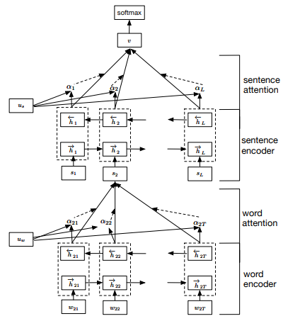
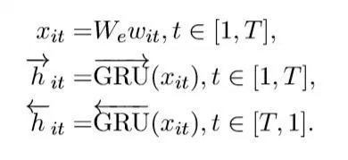
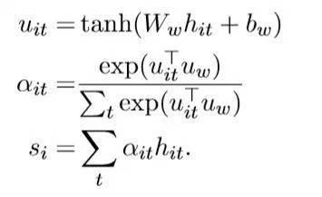
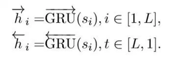
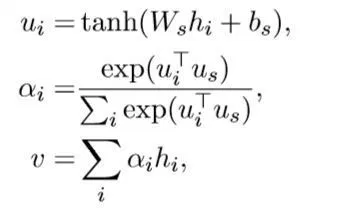
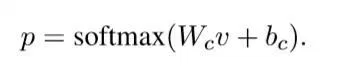
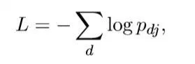
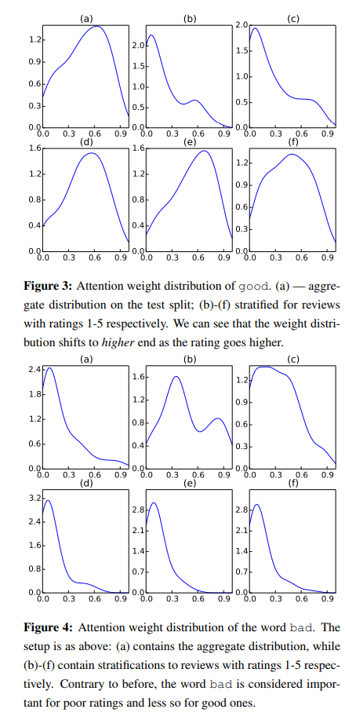
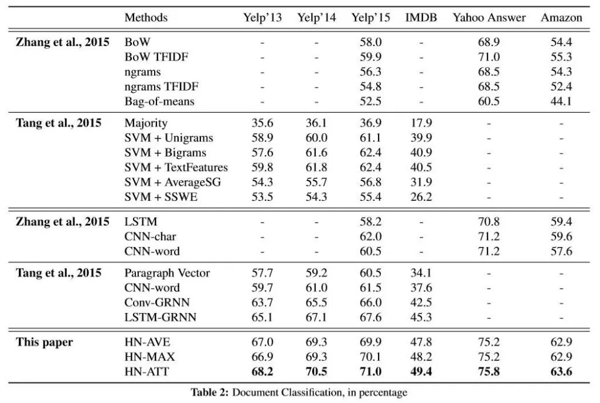

Attention Mechanism을 공부하면서 Sequence to Sequence 뿐만 아니라 분류에도 접목되는 부분이 있을까 알아보다가, 어탠션 메커니즘을 적용해 분류를 진행한 논문 Hierarchical Attention Networks for Document Classification [논문](http://www.cs.cmu.edu/~./hovy/papers/16HLT-hierarchical-attention-networks.pdf)에 대해 다뤄보도록 하겠습니다. 모든 내용과 이미지는 해당 논문을 참고합니다.

구현 코드는 [깃헙](https://github.com/hskimim/Natural_language_Processing_self_study/tree/master/Attention_for_classification) 사이트를 참고해주시면 감사하겠습니다.

## Abstract

문서 분류를 위한 계층적 어탠션 네트워크를 제시한다. 우리의 모델은 두 가지 특징이 있다. i) 문서의 계층적 특징을 따르는 계층적 구조를 지닌다. ii) 문서 표현을 구성하고 분류를 진행할 때, 단어 레벨과 문장 레벨에서 중요한 부분에 집중하기 위해 어탠션 메카니즘을 두 가지 레벨로 진행한다. 여섯 가지의 문서 분류 데이터를 사용하고 이전의 연구들과 비교해서 큰 성능 차이로 우위를 지님을 알 수 있다. 어탠션 레이어의 시각화는 모델이 정보력있는 단어와 문장을 선택하였음을 알 수 있다.

## Introduction

문서 분류는 NLP의 근본적인 과업이다. 목표는 텍스트에 라벨을 할당하는 것이다. 이러한 과업은 토픽 모델링, 감성 분류, 스팸 감지와 같이 넓은 분야에 적용된다. 전통적인 접근 방법은 단어들을 sparse한 사전적 특징을 통해 표현(n-gram)하여, linear model, kernel methods 등을 사용한다. 최근에는 CNN, RNN(LSTM,GRU etc)와 같은 딥러닝 방법을 통해 텍스트 표상을 학습시킨다. 인공 신경망 모델을 기반한 접근법이 문서 분류에 효과적임이 그동안 드러났지만, 해당 논문에서는 문서의 구조(단어 $\rightarrow$ 문장 $\rightarrow 문서) 를 반영한 모델의 구조가 더 나은 표상법이라는 가설을 기반으로 한다. 우리의 모델 기저에 깔려 있는 직관은 어떠한 질문에 대답하는 쿼리(해당 질문의 정보력의 출처와 같은 맥락인 것 같습니다.)는 문서의 각각의 요소에서 동일한 영향력을 지니는 것이 아니며, 단어들 간의 상호 작용에 영향을 미친다는 것을 기반한다. (어탠션과 RNN based model을 쓰는 근거가 됩니다.)

해당 연구의 주요 기여도는 문서 구조의 두 가지 기본 인사이트를 "계층적 어탠션 네트워크"를 통해 포착했다는 것이다. 첫 째로 하나의 문서는 계층적 구조를 띄기 때문에, 먼저 문장에 대한 표상을 구상한 후에, 문상에 대한 표상들을 한 데 모아서(aggregate) 문서에 대한 표상을 구성한다. 두 번째로, 문서 내에 존재하는 다른 단어들과 문장들은 다른 정보량을 가지고 있게끔 관찰된다. 또한, 단어와 문장의 중요도는 문맥 의존성을 따르는 경우가 많다. (같은 단어와 같은 문장도 문맥에 따라 그 중요도가 다르다.)

이에 따라 해당 모델은 두 층의 어탠션 레이어를 가진다. 하나는 단어 레벨에 있고 다른 하나는 문장 레벨에 존재한다. 이러한 어탠션 레이어는 문서를 구성하는 문장과 단어들에 있어서 고르지 않은 정보력을 반영하게 해준다. 이러한 어탠션 메커니즘은 두 가지 기여도를 지닌다. 첫 번째는 성능을 높여주고, 두 번째는  해당 문서의 분류 결정에 어떤 문장과 어떤 단어가 기여했는지에 대해 알려줄 수 있다.

## Hierarchical Attention Networks

위의 이미지와 같이, 해당 모델은 word sequence encoder, word-level attention layer, sentence encoder, setence-level attention layer 로 나뉜다. 하나씩 살펴보자.

**GRU-based sequence encoder**
요약 : GRU 아키텍처를 따른다.

**Hierarchical Attention**
해당 연구에서는 문서 레벨의 분류를 진행한다. 하나의 문서가 $L$ 개의 문장들을 가지고, 하나의 문장은 $T_{i}$ 개의 단어들을 가진다고 가정한다. $w_{t}$은 $i$번째 단어의 단어 하나를 의미한다.

- Word Encoder
단어 임베딩을 해서, bi-directional GRU를 사용한다. 더 완전한 모델을 위해서는 단어를 바로 GRU에 적용해야 하지만, 간단하게 하기 위해서 생략하였다.

- Word Attention
모든 단어가 문장의 의미를 대표하는 동일한 기여도를 가지는 것이 아니기 때문에, 어탠션 메커니즘을 적용한다. 또한 이렇게 나온 각 단어의 정보력은 문장 벡터를 구성하기 위해 합쳐진다.(aggregate)

위의 이미지에서 $h_{it}$는 단어들을 bi_GRU에 넣고 반환한 각 스텝마다의 hidden state 값이다. 그 후에, one-layer MLP(linear function에 넣고 activation function에 넣어준 값)을 통해 $u_{it}$를 확보한다. 그 후에, word Encoder가 반환한 context vector인 즉, word level context vector $u_{w}$와 유사성을 계산하여 정규화된 정보력 가중치 $\alpha_{it}$를 계산한다.

그 이후에, $u_{it}$를 $\alpha_{it}$와 곱해(가중 평균을 취해주는 꼴) 문장 벡터 $s_{i}$를 계산한다.

- Sentence Encoder
위에서 계산된 $s_{i}$를 bi-directional GRU 에 적용한다.

- Sentence Attention
문서 분류에 차등적인 정보력을 담고 있는 문장들의 가중치를 상이하게 두기 위해 어탠션 메커니즘을 문장 레벨에서도 적용한다. $u_{i}$는 Sentence Encoder가 반환한, context vector이고, 나머지 계산 방법은 Word Attention과 동일하다.

- Document Classification
마지막 모델의 반환값은 softmax 이다.

loss function 은 NLL loss function이다.($j$는 문서$d$의 라벨이다.)

## Model configuration and training
- embedding dimension : 200
- GRU hidden dim : 50
- batch size : 64
- optimizer : SGD (learning rate은 validation 에서 grid-search로 선택, momentum of 0.9로 선택하였다.)

##  Context dependent attention weights

위의 이미지에 대해 설명을 해보면, 위의 이미지는 "good"이라는 단어에 대한 표로, a는 단어의 가중치 분포를 모두 합친 것이고, b부터 f까지는 리뷰 데이터의 평점이 1부터 5까지 갔을 때, 달라지는 가중치 분포이다. 평점이 높아질 수록, 가중치 분포가 위쪽으로 이동하고 있음을 볼 수 있다.

 아래의 이미지는 "bad"에 대한 단어 분포로 마찬가지로, 평점이 낮아질 수록, 분포가 아래쪽으로 갈 수록 분포가 아래쪽으로 이동하는 것을 볼 수 있다. 즉, 문맥에 따라 변동하는 단어의 어탠션 가중치를 확인할 수 있다.
## Results

## Conclusion
해당 논문에서는 문서 분류를 위해서 계층적 어탠션 네트워크 (HAN : Hierarchical Attention Networks)를 적용했다. 계층적 구조와 어탠션 메커니즘을 통해, 성능을 향상시키고 분류 결과 요인을 분석하고 시각화할 수 있다는 장점이 있다.
