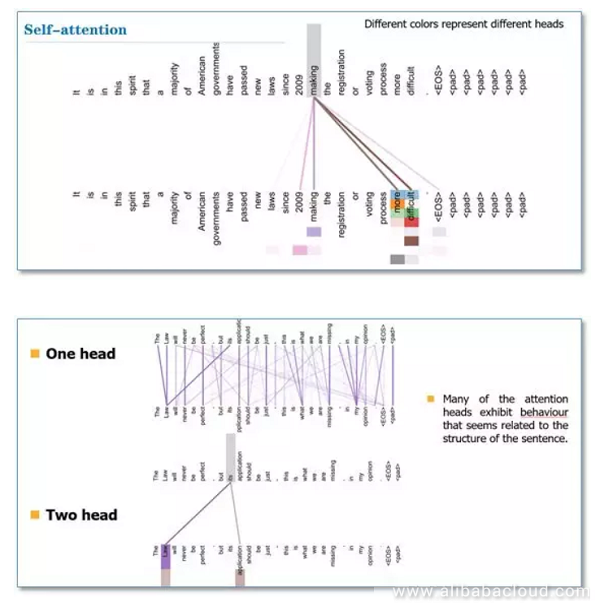

"Attention Is All You Need" 논문을 읽으면서, 어탠션 메카니즘에 대한 보다 깊은 이해가 필요하다고 느껴짐에 따라, Self-Attention(Intra-Attention) 에 대해 자료를 보고 정리한 것을 기록해보도록 하겠습니다. 이해가 부족함에 따라 잘 못 쓰여진 글들에 대해 피드백 해주시면 감사드리겠습니다!!

Reference :
1.  https://lilianweng.github.io/lil-log/2018/06/24/attention-attention.html#comment-4299312313
2. https://medium.com/@Alibaba_Cloud/self-attention-mechanisms-in-natural-language-processing-9f28315ff905
3. https://mp.weixin.qq.com/s?__biz=MzIwMTc4ODE0Mw==&mid=2247486960&idx=1&sn=1b4b9d7ec7a9f40fa8a9df6b6f53bbfb&chksm=96e9d270a19e5b668875392da1d1aaa28ffd0af17d44f7ee81c2754c78cc35edf2e35be2c6a1&scene=21#wechat_redirect
4. http://www.modulabs.co.kr/?module=file&act=procFileDownload&file_srl=20755&sid=453cc69bc33037b5ff7a4e635cc1655e&module_srl=17958

_____________________________________

"Attention Is All You Need" 논문을 보게 되면, Q, K, V 라는 선형 변환(linear transformation)을 통해 나오는 세 개의 행렬이 나옵니다. 각각이 의미하는 것이 무엇일까요? 상황을 예로 들어 이야기해볼 수 있습니다. 제가 해적왕이 되기 위해, 동료들을 모집하고 있습니다. 이 때, 저는 조타수와 요리사 항해사 등등의 역할들을 해줄 최적의 선원이 필요하겠죠. 사람들을 쭉 세워놓고 가장 적합한 인물들을 뽑아야 합니다.

여기서 Query(쿼리)는 제가 필요로 하는 역할(조타수와 요리사 항해사 등)들을 의미합니다. Key(키)는 일렬로 쭉 세워둔 사람들을 의미합니다. 따라서, 제가 정해둔 역할 Q에 가장 적합한 K들 간의 적합성들을 보고 가장 훌륭한 조합을 결정해야 겠죠. 이 때, 최적의 (Q,K)만을 볼 것이 아니라, 이렇게 정해진 K들이 모여서 팀이 이뤄졌을 때, 팀 간의 조화 또한 중요한 의사결정의 척도가 될 것입니다. Value(밸류)의 경우, 일렬로 쭉 세워둔 인원들의 적합성을 계산해서, 이들에게 점수를 매겨주는 대상이 됩니다. 실질적으로 Key와 같은 대상이지만, 쓰임이 다른 것이라고 생각하시면 좋을 것 같습니다.

위의 이미지는 Encoder Decoder 아키텍쳐 내에서 Attention 메카니즘을 적용했을 때 그 적합성을 시각화한 표입니다[[참고]](https://arxiv.org/pdf/1409.0473.pdf). 만약 영어를 프랑스어로 번역하는 문제였다면, 특정 프랑스 단어를 번역하는 데(Q) 가장 적합한 영어 단어(K)를 계산하는 과정을 어탠션 메카니즘이 개입하게 되는 것이죠.

어탠션을 계산하는 과정 즉, 최적의 (Q,K)의 조합을 정량화하는 방법은 여러 가지가 있습니다. 대표적으로 Additive 와 Product 방식이 있는데, 이는 위의 표와 같습니다. Transformer의 경우, Scaled Dot-Product 방식으로 Dot-Product 방식에서 히든 스테이트의 차원에 square root를 취한 것을 나눠줌으로써, 값이 너무 커지는 것을 막았습니다.(scaling factor)

지금부터는 Self-Attention(Intra-Attention)에 대해 이야기해보도록 하겠습니다. 위에서 말씀드렸던 English-to-French의 경우 Q는 French 의 단어 토큰이었고, K는 English의 단어 토큰이었습니다. 하지만, Self-Attention의 경우, Q와 K가 같은 문장 즉, 동일한 input sequence 에서 오게 됨에 따라, Q,K,V 가 같은 source sentence 를 가집니다.

그렇다면 중요한 질문이 뒤따르게 됩니다. "왜 Self Attention"을 할까??

이는, 단어 간의 의존적인 내부 구조를(dependent intra-structure) 고려해주기 위해서 입니다. 사실, 저희는 이미 동일 문장 내에서 의존성을 계산해오고 있었습니다. 어떻게요? RNN이나 CNN 아키텍쳐를 통해서 말이죠. RNN Encoder를 예로 들어보면, source sentence를 인풋으로 넣어서 step을 나아가면서 히든 스테이트가 계산되고 이는 학습을 통해 최적화되어 갑니다. 이는 동일 문장 내에서 의존성 즉, 관계성을 학습해나가는 과정이라고 해석할 수 있는 것이죠. 하지만, 문장의 길이가 엄청 길 경우 (예로 들면, n > 100) 문장의 가장 첫 번째 단어와 마지막 단어 간에 관계성이 미치기 힘들 것이다. 흔히 말하는 long-term dependency 문제가 발생하게 되는 것입니다. 이에 따라 LSTM이나 GRU 와 같은 memory gate를 사용하는 아키텍쳐를 사용해서 의존성에 대한 정보를 보존하려는 노력들이 존재하는 것이죠.

결과적으로 Self-Attention은 동일 문장 내부 구조 상의 관계성 및 의존성을 파악하기 위한 일련의 과정으로 해석할 수 있습니다. 그렇다면 해당 메카니즘이 기존의 RNN, CNN과 어떻게 다를까요?

첫 번째로 연산 속도입니다. 참고한 블로그의 글을 인용해 보면, "RNN needs to be recursively step by step to capture, while CNN needs to be cascaded to expand the receptive field" RNN은 정보를 포착하기 위해 recursive하게 스텝 바이 스텝으로 진행이 되고, CNN의 경우 정보를 인식하는 영역을 넓히기 위해 계단식으로 움직입니다. 하지만, 어탠션의 경우 행렬 곱(dot-product)을 진행하기 때문에, sequence_length X sequence_length의 행렬 곱 연산으로 진행이 됩니다. 일반적으로 hidden state의 차원 $d$ 보다, sequence length의 차원 $n$이 더 작기 때문에, 연산의 복잡도가 더 낮아지게 되는 것이죠. 만약 sequence length가 매우 길어서 $d$보다 길어지게 된다면, local attention을 적용하여, (stricted attention) $n^2$ 의 복잡도를 $r X n$ (r : window size)로 줄일 수 있게 됩니다.

두 번째로는 장거리 의존성에 대한 문제입니다. RNN의 경우 문장이 길다고 했을 때, 문장의 가장 첫 번째 토큰에서 recursive 연산을 시작해 마지막 토큰까지 가기 위해서는 sequence length 만큼의 path가 존재합니다. 즉, 그만큼 연산을 거쳐한 한다는 것이죠. 반면 Attention 을 적용하게 되면, 문장의 첫 번째에 해당 하는 Q와 문장의 마지막에 해당하는 K의 행렬곱을 해주는 연산으로써 바로 의존성을 계산할 수 있게 됩니다. 위의 표에서 보실 수 있다시피 Sequential Operation과 Maximum Path Length가 상수의 복잡도를 가지게 됩니다.

요약해보면, Self-Attention은 동일 문장 내에 의존성 및 관계성을 알아내기 위한 과정이며, 연산의 복잡도와 연산 거리가 상대적으로 줄어드는 효과가 존재한다. 입니다.

그러면 마지막으로 한 가지만 더 이야기해보도록 하겠습니다. 바로 Multi-Head Attention 에 대한 문제입니다. 논문 내에서는 Multi-head Attention을 사용하는 이유는 다른 위치에서 다른 부분 공간 표상을 동시에 학습하는 효과가 있다라고 언급이 되어 있었습니다. "Multi-head attention allows the model to jointly attend to information from different representation subspaces at different positions."

만약 헤드가 하나일 경우에는, 문장 내에 특정 단어 간 (토큰1, 토큰2) 어탠션을 한 번밖에 하지 못하게 됩니다. 예로 들어, 지하 세계를 지키는 경비견이 한 마리 있다면, 자신이 보는 방향만 주시하고 경계를 설 수 있다는 이야기가 됩니다. 하지만, 헤드의 갯수만큼 차원을 쪼개서 헤드의 수만큼 어탠션을 취하게 되면, 케르베로스의 머리가 세 개이고 각기 다른 높이과 관점에서 경계를 3번 보게 되면, 기존의 경비견보다 더 경계를 잘 서지 않을까? 즉, 더 많은 정보를 포착할 수 있지 않을까라는 아이디어에서 기인하게 됩니다.

위의 그림은 헤드가 하나일 때와 헤드가 두 개일 때, Self-Attention이 다른 결과값을 보여준다는 것을 시각화한 그래프입니다. 헤드가 1일 때는 its 토큰이 law라는 단어에만 어탠션을 취하고 있지만, 헤드가 두 개일 경우, its 토큰이 law와 application 토큰에 어탠션이 주어져 있는 것을 볼 수 있습니다. 즉, 다른 관점에서 본 각기 다른 어탠션 연산이 합쳐서 여러 관점에서 적합성을 보고 취합할 수 있게 되는 것입니다.

Transformer의 한계점을 보완하기 위해, Transformer-XL, Sparse Transformer가 뒤를 잇고 있는데, 이에 대해 논의하기 전에 Attention Mechanism 과 Self-Attention에 대해 자료를 정리하는 시간을 가져보았습니다. 피드백 주시면 대단히 감사하겠습니다!
