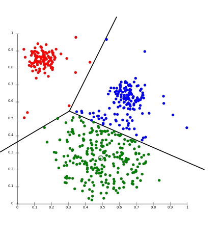

기존의 Active Learning은 라벨이 없는 데이터에서 개별 인스턴스의 정보량을 파악해, 이에 따른 개별 인스턴스를 쿼리하는 방식이였
습니다. 해당 방법론은 적은 라벨 데이터로도 지도 학습의 성능까지 충분히 끌어올릴 수 있다는 점에서 각광받았지만, 현실적으로 개별 데이터에 대한 라벨을 사람이 주석을 하나씩 단다는 것은 시간적으로 매우 비효율적이라는 점에서 문제가 있었죠. 이에 따라서, 배치 방식으로 쿼리를 보내는 방법론인 batch-mode active learning 이 제안이 되었습니다. batch-mode active learning 의 방법론 중 2019년에 나온 Amazon Research 의 논문 ["Diverse mini-batch Active Learning"](https://arxiv.org/pdf/1901.05954.pdf) 에 대해 요약 정리해보려 합니다. 방법론이 타 논문에 비해, 비교적 간단하고 직관적이라 읽어보시면 매우 유익할 것이라 생각이 듭니다!!

구현 코드는 아직 부족한 점이 많지만, [깃헙](https://github.com/hskimim/active-learning-tutorial/tree/master/Diverse_minibatch_Active_Learning)을 참고하시면 이해에 도움이 되실 것 같습니다!
__________________________________

Batch-mode Active Learning 을 어떻게 해볼까 생각을 해보면, 매우 나이브하게는 아래와 같을 수 있습니다.

"모든 데이터에 대해서 softmax와 같은 분포 정보를 반환하고, 정보량이 높은 k 개의 인스턴스를 쿼리한다!!"

이렇게만 되면, 정말 좋겠죠? 하지만 위와 같은 방법론은 "쿼리한 인스턴스의 정보량이 유사함에 따라, k개의 인스턴스가 개별 정보를 가지지 못해, learner의 성능 향상에 충분한 기여를 하지 못할 수 있다" 라는 문제가 발생하게 됩니다. 즉, 쿼리한 인스턴스가 각자 다른 이유로 정보력이 높다면 이상적이지만, 비슷한 input space에 존재함에 따라 이를 쿼리하게 되면, 굳이 하지 않아도 되는 라벨까지 사람이 주석을 달아야 하는 redundancy가 존재하게 될 수 있다는 것이죠. 이에 따라, batch-mode active learning에는 두 가지 요구 조건이 뒤를 따릅니다.

```
1. 쿼리하는 모든 인스턴스는 정보력이 있어야 한다. (informative)
2. 쿼리하는 인스턴스는 서로 분별된 정보를 가지고 있어야 한다. (diversity)
```

1번은 Active Learning의 주요 아이디어와 매칭되는 개념이라면, 2번이 배치 모드로 쿼리하는 과정에서 주요한 관점이 되겠습니다. 2번을 해결하기 위해 submodular function과 같이 다양한 알고리즘을 통해 해결하려는 시도들이 이전에 있어 왔습니다. (아직 어려워서 공부 중에 있습니다.. 추후에 업로드하도록 하겠습니다ㅎㅎ)

해당 논문 역시, 2번에 대한 방법론을 제시하는 논문이라고 할 수 있습니다.

### 방법론




위의 그림은 k-means algorithm을 대표하는 이미지입니다. 라벨은 알 수 없지만, 데이터들을 input space에 흩뿌린 상태에서 밀집한 것들을 같은 클러스터로 본다라는 아이디어에서 나온 알고리즘입니다. 공식은 아래와 같습니다.

$$f(S) = \sum_{x_{i} \in X^{U}} min_{x_{j}\in S} d(x_{i},\mu_{j})$$

위의 식을 풀어보면, 라벨이 없는 데이터(비지도 학습이기 때문입니다)와 특정 centriod 와의 거리를 최소화하는 centriod 를 반복을 통해 계산하는 작업이 됩니다. $j$개의 centriod는 $j$개의 클러스터를 생성하고 새로운 데이터가 들어오면, 각각의 centriod 중 가장 가까운 위치에 있는 클러스터에 속하게 되는 것이죠. 이제 슬슬 감이 오셨는지 모르겠지만, 해당 논문은 쿼리하는 $j$ 개의 인스턴스가 각각 다른 클러스터에 속하게끔 하여, diversity를 충족시키게끔 합니다.

정보의 양도 중요하지만, 정보의 다양성도 중요하기 때문에, 이를 각각의 centriod와 얼마나 가까운지까지 고려해 인스턴스의 정보력을 계산하겠다의 맥락이 되는 것입니다. 이러한 아이디어에 따라 아래의 새로운 목적 함수를 제시합니다.

$$\sum_{x_{i} \in X^{U}} z_{i,k} s_{i} ||x_{i} - m_{k}||^{2} \rightarrow \min$$

위의 등식에서 $z_{i,k}$ 는 거리를 계산할 때, 데이터들을 해당 클러스터에 속하는 데이터의 거리만 계산할 수 있게끔 하는 [0,1] 두 개의 값을 가지는 값입니다. $s_{i}$ 는 $i$ 번째 인스턴스의 정보량에 대한 것입니다.

$$z_{i,j} \in \{0,1\} \\ z_{i,j} = 0 \text{ if } i \ne k$$

### 실험 과정

논문의 저자는 query strategy에서 Margin Sampling을 사용합니다. 논문 내에서 Least Confidence나 Entropy sampling은 종종 random sampling보다 성능이 낮아, 해당 방법론을 사용했다고 합니다. 쿼리를 하는 인스턴스의 크기 $k$ 에 대해서는 데이터셋 자체의 크기에 따라 다른 값을 적용했다고 했습니다. 전체적으로는 $k=100$ 을 적용했지만, 상대적으로 빅데이터인 CIFAR 100에 대해서는 1000을 적용했다고 합니다. 또한, 전체 데이터($U$) 에 대해서 k-means 알고리즘을 적용한 것이 아니라, 일부 데이터에 대해서만 클러스터링을 적용하였는데, 그에 대한 크기도 파라미터가 됩니다. 공식은 아래와 같습니다.
$$\beta k > k$$
즉, $\beta$는 양수가 되는데, 예로 들어서, 10개의 인스턴스를 쿼리하기로 하였고, $\beta$ 를 10으로 설정하였다면, 후보군 데이터셋을 100개로 선정하여, 클러스터링을 한 것이 됩니다. 이는 굉장히 중요한 파라미터로 이 또한 데이터셋의 크기에 따라 적정값이 존재하며, 데이터셋의 크기가 클 수록 큰 $\beta$ 가 권장된다고 하였습니다. 또한, 쿼리하는 인스턴스의 갯수 $k$에도 의존적이라고 합니다. 아래 Section 에 따르면 $\beta = 10$ 이 강건한 성과를 보인다고 하네요. 추가적으로 저자는 전체 데이터의 60~70 퍼센트의 데이터에 라벨링을 선별적으로 하는 것을 목표로 하였다고 합니다.


**알고리즘**

Input :
데이터셋 $x_{i}$ 배치 $B$ 배치 사이즈 $k$ 데이터셋 파라미터 $\beta$  을 세팅합니다.
초기 라벨 데이터는 랜덤 샘플링을 통해 하게 됩니다. (pre-train을 위해서 입니다!)

Repeat :
이전 단계에서 라벨링한 데이터로 모델을 트레이닝합니다.
트레이닝한 모델로 라벨이 없는 데이터를 예측하고, 정보량을 계산합니다.
$\beta$ 의 크기에 따른 데이터셋을 pre-filtering 합니다.(정보량 순)
데이터셋을 weighted($s_{i}$가 포함된) k-means algorithm에 적용합니다.
위의 알고리즘에 따라 내림차순으로 $k$개의 인스턴스를 쿼리합니다.

until :
남아있는 배치 데이터 $B$를 소진할 때까지 Repeat 단계를 반복합니다.

### Conclusion

해당 방법론은 이전에 이루어져왔던 submodular function을 통해 diversity를 해결해왔던 논문들과는 달리 k-means algorithm을 통해, diversity를 해결하려 했다는 점에 의의가 있으며, 연산 복잡도 또한, 기존의 지수 복잡도에서 선형 복잡도로 줄여 속도 면에서도 크게 기여했다는 점에 의미가 있을 것 같습니다.

개인적으로 느끼는 해당 논문의 가장 큰 기여도는 상대적으로 이해하기 쉽다.. 에 있을 것 같네요. 부족한 글 읽어주셔서 감사합니다. 피드백 절대 환영입니다!!
